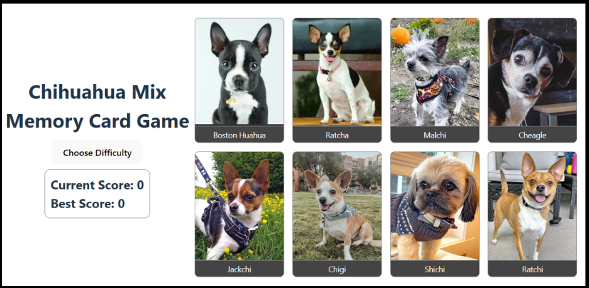

# Chihuahua Mix Memory Card Game

A memory card game featuring adorable Chihuahua mix breeds.
Built with React and TypeScript as a learning project to practice state management and component structuring.
This project is part of The Odin Project curriculum.



### 🔗 Live Demo

http://dainty-mousse-25cc78.netlify.app

---

## Features

- **Dynamic Cards**: Display randomized cards with unique Chihuahua mix breeds.
- **Difficulty Levels**: Choose between Easy, Medium, and Hard modes to adjust the number of cards.
- **Scoreboard**: Tracks your current and best scores.

---

## Tools Used

- **Development**: React, TypeScript, and Vite
- **Coding, Version Control**: Visual Studio Code, Git and GitHub
- **Deployment**: Netlify [](https://app.netlify.com/sites/dainty-mousse-25cc78/deploys)

---

## Learning Outcomes

This project was created as a learning exercise and provided hands-on experience with:

- State management using React Context and `useReducer`.
- Handling asynchronous data fetching in TypeScript.
- Basic game logic implementation, including score tracking and card shuffling.
- Leveraging types with TypeScript.

---

## How to Play

1. Visit the [live demo](http://dainty-mousse-25cc78.netlify.app).
2. Choose a difficulty level (Easy, Medium, Hard).
3. Click on cards to reveal them.
4. Avoid clicking the same card twice in one round to keep your score growing.
5. Aim to beat your best score!

---

## How to Run Locally

Make sure you have pnpm installed.

1. Clone the repository:
   ```bash
   git clone <repository_url>
   cd <repository_folder>
   ```
2. Install dependencies:
   ```bash
   pnpm install
   ```
3. Start the development server:

   ```bash
   pnpm run dev
   ```

4. Open the page in your browser.

---

## Image credits

| Breed         | Credit                          |
| ------------- | ------------------------------- |
| Chug          | frida_the_chug / Instagram      |
| Cheagle       | salty_the_cheagle / Instagram   |
| Pomchi        | chico.lilo.cleo / Instagram     |
| Chiweenie     | kalle_the_dog / Instagram       |
| Chipoo        | Annette Shaff / Adobe Stock     |
| Ratchi        | mydogsonny / Instagram          |
| Shichi        | tobi.biskit / Instagram         |
| Chigi         | lolawithasideofdeli / Instagram |
| Jackchi       | tedthejackchi / Instagram       |
| Malchi        | tobyteefs / Instagram           |
| Ratcha        | boyphare, shutterstock          |
| Boston Huahua | angelbandala, Shutterstock      |
| Cheeks        | havenforhaven / Instagram       |
